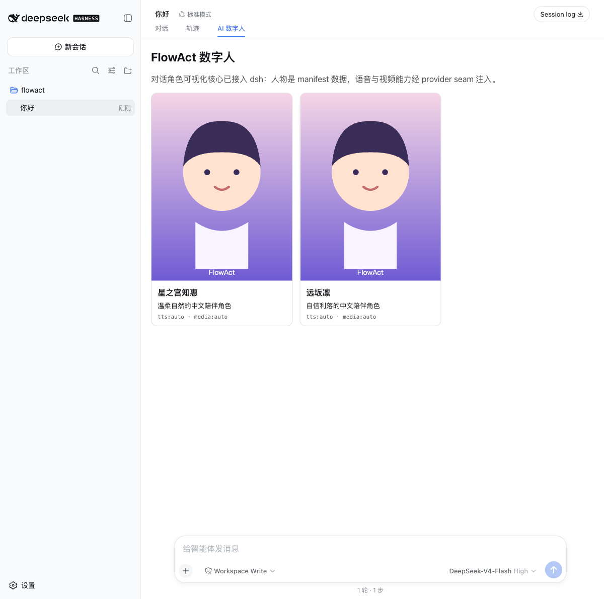

# LiveAI Talk

Animate any photo into a responsive virtual girl. She talks, turns, smiles, and moves naturally in sync with your conversation. Low-lag, high-detail.

## 三层结构

| 层 | 位置 | 职责 |
|---|---|---|
| dsh 插件壳（发布/安装/UI） | `package.json`、`cordis.patch.yml`、`src/index.js`、`src/client.js` | dsh bundle/client manifest、host 路由、浏览器 `conversation.view` 标签页与零 Key TTS 试听 |
| 对话角色可视化 core | `src/core/characters.js`、`character-registry.js`、`dialogue-pipeline.js`、`emotion.js`、`conversation-bridge.js` | 人物 manifest、人物注册表、与供应商无关的语义管线（句子切分、情绪/动作、TTS 清洗）、dsh session 事件桥 |
| 语音/视频 provider seam | `src/core/seams.js`、`provider-registry.js` | `asr` / `tts` / `avatar-media` 三个可替换能力注册表 |

当前是**能安装、能显示人物、语音/视频/实时 provider 齐备的切片**：人物卡来自 `/liveai/characters`，UI 通过 dsh slot 注册；host 已注册 `asr-doubao` / `tts-doubao` / `jimeng` / `realtime-volc` / `realtime-vidu` provider（密钥走 `ctx.credentials` 或本机代理），client 提供零 Key `browser-tts` / `browser-speech`。剩余事项是 `ctx.jobs` 长任务接入与发布整理（见 [ROADMAP.md](ROADMAP.md)）。



## 安装（当前 dsh 0.1.0-rc.5 验证）

```sh
dsh plugin --profile avatar add /path/to/liveai-talk
dsh --profile avatar --dump-config   # 应看到 liveai-talk 行
dsh --profile avatar web
```

打开 Web UI，在会话顶部视图标签选择 **LiveAI Talk**。

GitHub 直装需要 pin 提交并允许 `prepare` 构建脚本；npm/tarball 发布无需构建权限。

## 开发与测试

```sh
npm run build   # 从 src/ 生成 lib/（零依赖）
npm test        # build + 全部单元测试
npm run test:integration   # 需要 DSH_REPO 指向 deepseek-harness 源码
```

`test:integration` 会创建临时 `DSH_HOME`，安装 tarball，校验 `--dump-config`、启动 web 并请求 `/liveai/health`、`/liveai/characters` 和客户端 bundle。

## 发布

- 仓库添加 topic：`dsh-plugin`；
- npm：`npm publish`（`lib/` 已预构建）；
- tarball：`npm pack`，用户 `dsh plugin add ./dsh-liveai-talk-0.2.0.tgz`；
- 密钥类 provider 一律走 dsh `ctx.credentials`，不在 patch 或配置中携带；
- 完整清单见 [PUBLISHING.md](PUBLISHING.md)；素材边界见 [ASSET-LICENSE.md](ASSET-LICENSE.md)。

当前在 dsh `0.1.0-rc.5` 上验证通过。
